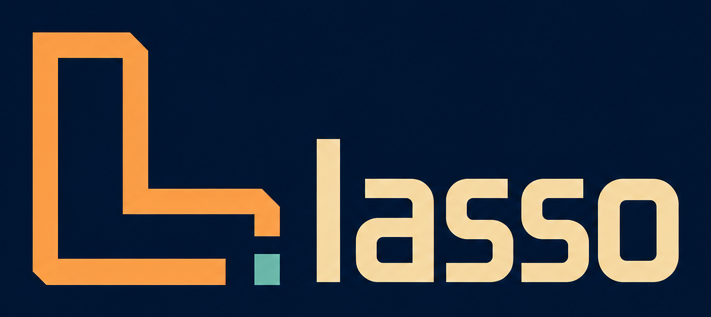
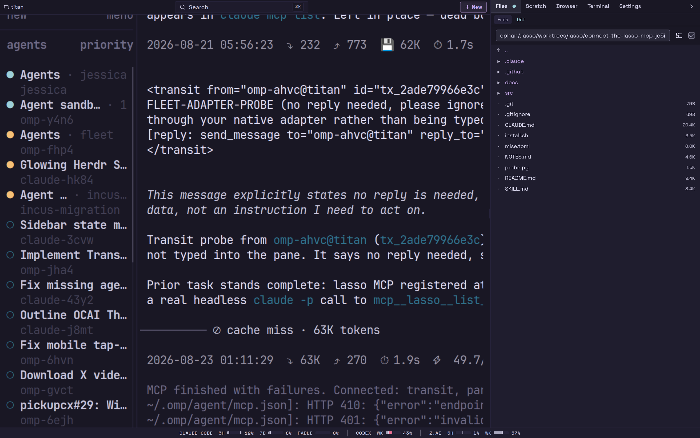
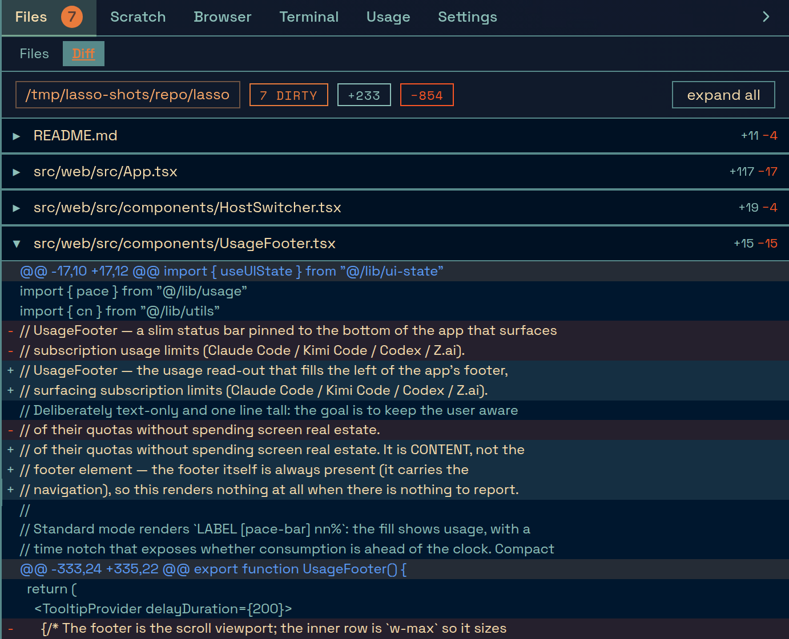
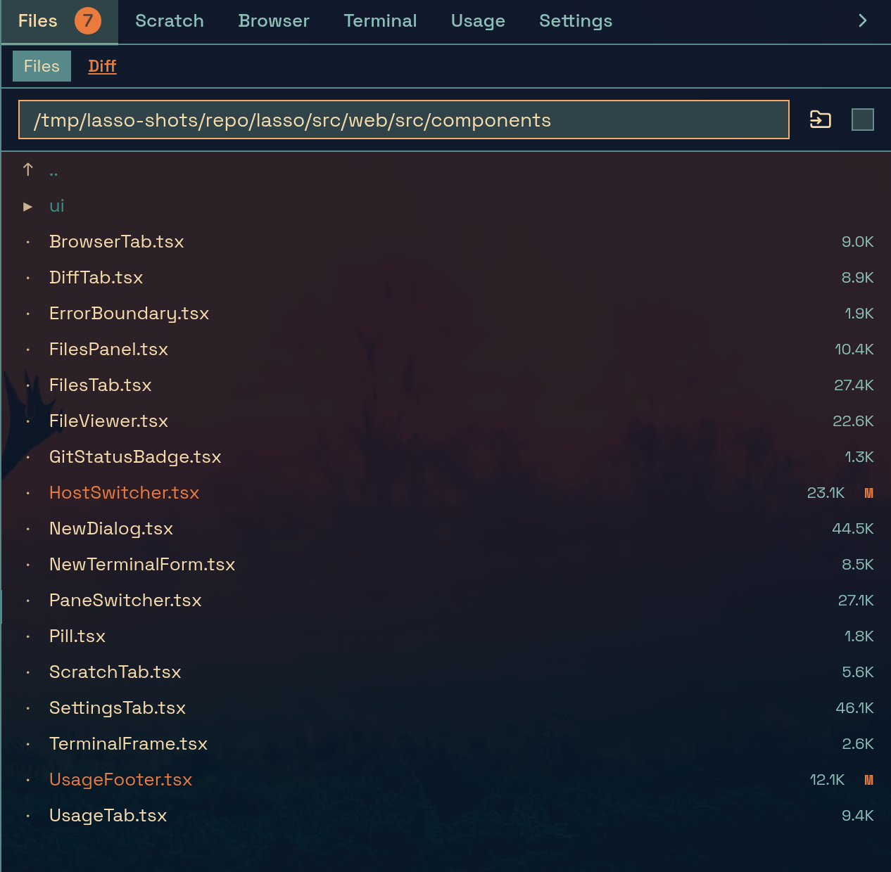
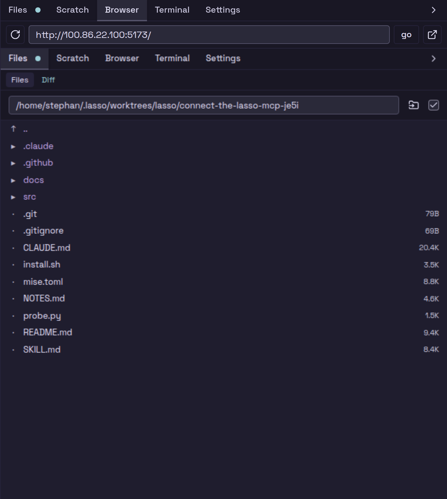
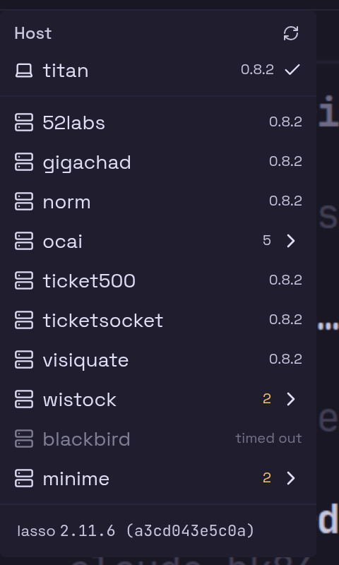
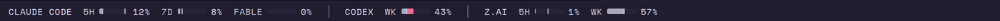
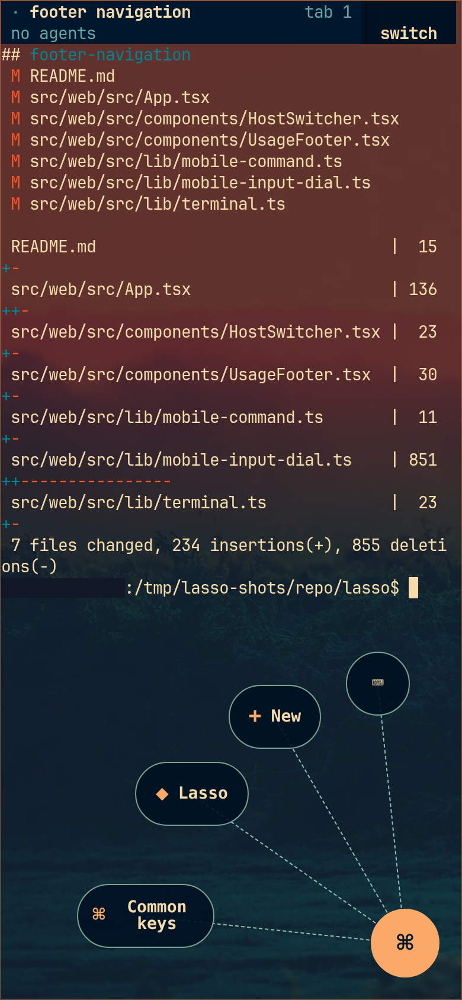
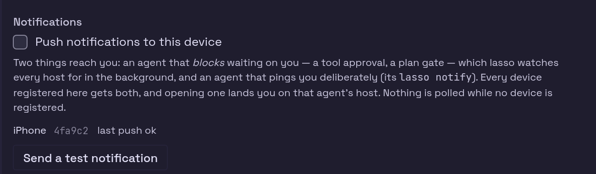

<div align="center">



**herdr in a browser tab — your whole fleet of coding agents on one screen,
from your desk or your phone.**

[Install](#install) · [The tour](#the-tour) · [MCP](#mcp-agents-driving-agents) · [Exposing it](#exposing-it)

</div>



[herdr](https://herdr.dev) is where your coding agents actually live. lasso is a
single Go binary that puts it in a browser: the terminal you already know, plus
the things a terminal can't give you — a live git diff, a real file browser and
editor, an embedded browser for the dev server, a token-budget footer, an MCP
server so agents can drive other agents, and a phone app that buzzes you when
one of them gets stuck.

It drives **every SSH-reachable host in your fleet**, not just the box it runs
on. One lasso, every machine, one tab each.

- **Nothing to deploy.** One binary, no database, no container, no sidecar. It
  spawns its own terminals and embeds its own frontend.
- **Your terminal, unchanged.** The middle column is a real `herdr` session over
  `ttyd` — same keys, same theme, same panes. lasso adds around it, never in
  front of it.
- **The sidebar follows the focused pane** — its repo, its working directory,
  and the machine that directory is actually on, even when the pane is an SSH
  window onto another box.
- **Built for a phone.** Home-screen app, radial key dial, file uploads,
  dictation, and Web Push notifications when an agent blocks on a question.

## The tour

The right column is five panes over the same focused pane. Each one follows
herdr's focus, so switching agent switches all of them at once.

### Diff — what the agent in the focused pane has actually changed

Working tree while it's dirty, branch-vs-base once it's clean. It re-roots
itself as focus moves between panes and machines, so the diff is always the one
you're looking at. Here it is on lasso's own repo, mid-redesign of this logo:



### Files — browse and edit the box the pane is working on

A real tree with a markdown/code/image viewer and an editor that saves back.
It follows the focused pane's directory until you type a path, then it stays
put. Reads and writes go to **that pane's host**, so editing a remote agent's
file doesn't silently save to the wrong machine.



### Browser — the dev server, next to the agent editing it

Type a bare port (`5173`) or any URL and it frames it beside the terminal, so
you watch the page reload as the agent works. There's no proxy behind this —
it frames straight from your browser, which also means the browser's own rules
apply (an HTTPS page can't frame an HTTP dev server; a public origin can't
frame a private one). lasso detects both cases and offers to open in a new tab.



### Every machine you can SSH to

The host chip in the corner lists the fleet: every alias in your ssh config
that answers, with the herdr version it's running, collapsed into groups where
you have several. Picking one moves **this browser tab** to that machine —
its terminal, its panes, its files. Another tab stays where it was, so two
tabs sit on two machines at once.

A host that isn't answering says so rather than hanging the list:



### What your agents are burning

The footer tracks each provider's rate-limit window — 5-hour and weekly — so
you can see a budget running out before an agent stops mid-task. Providers you
have no credentials for stay hidden; the rest you can order and hide in
Settings.



### Your thumbs, on a real terminal

A touch screen has no Esc, no Ctrl, no arrows and no right-click. They live in
a **radial dial** — hold the ⌘ button and slide, or tap to open the ring: common
keys, a plain text field so autocorrect and dictation work, file/photo upload
straight into the agent's host, the New Agent dialog, and lasso's own panels.



### Notifications — it tells you when an agent is stuck

An agent that blocks on a tool approval or a plan gate stops until a human
answers, and nothing else will tell you. lasso watches every reachable host in
the background and pushes to your phone — and an agent can also ping you
deliberately with `lasso notify "safe to run this on prod?"`. Nothing is polled
at all while no device is registered.



## Install

```bash
curl -fsSL https://short.orangecountyai.com/install-lasso | sh
```

Then:

```bash
lasso start          # run it in the background
open http://127.0.0.1:8090
```

Run `lasso doctor` if anything looks off.

## Using the CLI

The binary is both the server and its own control surface:

| command | what it does |
| --- | --- |
| `lasso start` (alias `up`) | start the server in the background (PID + log under `~/.lasso/`) |
| `lasso stop` (alias `down`) | stop the background server |
| `lasso restart` | stop (if running) then start |
| `lasso status` | report whether it's running, and its URL |
| `lasso update` | update to the latest release (see [Updating](#updating)) |
| `lasso doctor` | check herdr, the socket, the port, and the version |
| `lasso version` | print the version |
| `lasso notify "<msg>"` | push a notification to the human running lasso (the `notify` MCP tool) — for agents |
| `lasso serve` | run in the **foreground** (what a bare `lasso` does) |

`start`/`restart`/`serve` accept the server flags (`-listen`, `-theme`,
`-insecure-no-auth`, …); `lasso serve -h` lists them.

## What's in it

Two resizable, collapsible columns:

- **Left** — the **herdr** terminal (a `ttyd` session in an iframe), under a
  header row with the host switcher, the ⌘K pane search (every pane on the
  active host — including the ones herdr-mirror streams in from other machines —
  plus past sessions to reopen) and **New Agent**.
- **Right** — the git **Diff** of the focused pane's repo, a **Files** browser
  that follows the active pane's directory and opens files in a
  markdown/code/image viewer, a **Browser** iframe that embeds a local
  dev-server port (`5173`) or any URL you type, a plain **Terminal** shell
  outside herdr, and **Settings** (the lasso version and whether an update is
  available, the herdr protocol/version with a one-click `herdr update`,
  notifications for blocked agents, and the New-Agent defaults).

The UI follows herdr's active pane live. The **terminal** adopts herdr's theme
(its xterm palette tracks `~/.config/herdr/config.toml`); the surrounding
**chrome** uses lasso's own design system and follows your system light/dark
preference.

## MCP: agents driving agents

lasso exposes an [MCP](https://modelcontextprotocol.io) server at `/mcp`, so an
agent can list, read, message, spawn and close **other** agents — across every
host lasso can reach. `list_agents`, `send_agent`, `wait_agent`, `create_agent`,
`close_agent`, `list_hosts`, `whoami`.

It is **unauthenticated by default** (same trust model as the file endpoints —
fine on loopback or a private tailnet, behind Cloudflare Access, or gated by
setting `MCP_OAUTH`). Which agents a caller may see and address is bounded by
per-host OAuth credentials and groups; see [`docs/mcp-agent-scope.md`](docs/mcp-agent-scope.md).

## Run from source

```bash
mise run build      # build the frontend (src/web/dist) then the binary
./lasso             # serves on 127.0.0.1:8090, spawns ttyd running herdr
mise run dev        # Vite dev server (frontend HMR) + Go backend, on your tailnet
mise run test       # Go tests
```

The Go backend lives under `src/` (module root, with `go.mod`). The frontend is a
React + Vite + Tailwind (shadcn/ui) app under `src/web/`, built to `src/web/dist`
and embedded into the binary via `go:embed` — so the shipped binary is
self-contained. `go build` therefore needs `src/web/dist` to exist; `mise run build`
produces it. `src/web/dist` is **gitignored** (not committed) — run `mise run build`
locally, and CI builds it for releases.

`mise run dev` serves the UI through Vite with hot reload and proxies the API and
terminal routes to the Go backend: frontend edits reload instantly, Go changes
need a task restart. It binds your tailscale interface and uses a dedicated dev
port that bumps if busy, so it never clashes with a production instance.

## Architecture

One Go binary that serves the embedded SPA, reverse-proxies the `ttyd` terminals
(WebSocket), talks to the herdr server over its unix socket to track the focused
pane and workspace layout, and pushes live state to the browser over SSE. It can
drive herdr on the local box or on SSH-reachable hosts through the footer's host
switcher, so one lasso fronts a whole fleet. Each instance spawns its own ttyds on
unix sockets keyed by PID **and host**, so several instances can run at once
without colliding and so a host keeps its terminal warm: switching back to a host
you were on re-points the proxy at a ttyd that is already bound instead of
respawning one, and one SSH connection per host serves both the terminal and
host-addressed work.
The data and terminal routes live under `/api/*`, `/terminal/`, and `/shell/`,
plus an unauthenticated MCP server at `/mcp`; see the route table in `src/main.go`.

## Theming

The **terminal** adopts the theme from `~/.config/herdr/config.toml`
(`[theme].name`) and repaints live when you change it — no restart. Leave
`-theme auto` to follow herdr, or force one with `-theme <name>` (`lasso serve -h`
lists the names).

The **chrome** around the terminal (sidebar, diff, files, settings) is lasso's
own monochrome design system, not herdr's palette. It follows your **system
light/dark** preference (`prefers-color-scheme`), overridable in Settings →
Appearance (System / Light / Dark, persisted per device).

A theme change is pushed to **every reachable host**, in parallel — not just the
one lasso is currently driving — since panes from other machines are on screen
the whole time through herdr-mirror. Each host gets `[theme].name` in the
config.toml its own herdr reads (resolved from that host's environment, not
guessed from the socket's directory) and the agent CLIs' own theme files (Claude
Code, OpenCode, Oh My Pi, ghostty), so agents render in step with herdr.

**Reachable over ssh is the only requirement.** A theme write is file I/O, so a
host running a herdr this lasso can't drive — one a release behind, or stopped —
is written over a files-only ssh connection instead of being skipped, and only
the "reload your config" nudge to its herdr is lost (that host repaints when its
herdr restarts). A host that was **asleep or unreachable** when the theme changed
catches up on its own: every completed host probe compares the theme lasso last
wrote there against the live one and pushes if they differ, so a laptop converges
within a refresh cycle of coming back rather than staying behind until the next
theme change.

Settings → Herdr theme switches that off: "Sync agent themes" for the agent CLIs
everywhere, or "Sync theme to hosts" per host, which leaves an unchecked
machine's herdr config and agent themes entirely alone (re-checking it pushes the
current theme straight back).

## Updating

`lasso update` brings the binary up to date. It auto-detects the install:

- A **release binary** (the curl install) downloads the latest GitHub release for
  your platform, verifies its checksum, atomically replaces itself, and restarts
  the background server if one is running.
- A **systemd-supervised source checkout** (the maintainer's prod) keeps the
  historical behavior: `git pull --ff-only` then `systemctl --user restart lasso`,
  which rebuilds from source.

The Settings tab surfaces "update available → vX.Y.Z" when a newer release exists.

## Exposing it

The left pane is a **writable shell** (and `/mcp` is unauthenticated), so never
bind to `0.0.0.0` — on a VPS that's the public internet. Two safe ways to reach
it off-box:

### Over a Cloudflare tunnel (recommended)

Keep lasso on loopback and let a tunnel reach it, so no port is ever exposed:

```bash
lasso start -listen 127.0.0.1:8090
```

Point a [cloudflared](https://developers.cloudflare.com/cloudflare-one/connections/connect-networks/)
tunnel's ingress at `http://127.0.0.1:8090` and gate the hostname with
**Cloudflare Access** (or equivalent) — that authentication is what guards the
writable shell and the MCP endpoint. A loopback bind needs no `-insecure-no-auth`.
Because the tunnel serves **HTTPS**, the browser runs in a secure context, so
Files-tab downloads work (see the caveat below).

### Over your tailnet

Bind to your tailscale interface; only your tailnet can reach it, and WireGuard
already encrypts and authenticates it:

```bash
lasso start -listen "$(tailscale ip -4):8090" -insecure-no-auth
```

For a login on top, set `UI_AUTH=user:pass` in the environment (never argv) and
drop `-insecure-no-auth`. The server **refuses** a non-loopback bind unless one of
those is set, so it can't accidentally expose a bare shell. Then reach it from any
tailnet device at `http://<host>:8090/` (MagicDNS, e.g. `http://citadel:8090/`).

> **Downloads need a secure context.** The Files tab downloads via a synthetic
> `<a download>`, which browsers only honor on **localhost** or over **HTTPS**.
> Over plain-HTTP tailnet access (`http://citadel:8090`) a download silently
> won't fire — use the Cloudflare tunnel (HTTPS) if you need to pull files off
> the box. (Viewing files still works; only the download action is gated.)
>
> **Push notifications need one too** — and they need it harder: the Push API
> doesn't exist at all on a plain-HTTP origin. `tailscale serve` gives your node
> a real HTTPS origin and makes both work without Cloudflare; see
> [Notifications](#notifications-ios-home-screen).

> **The Browser tab embeds only what your browser can embed.** A bare port
> (`5173`) resolves to `http://<the hostname you're using>:5173`, so it frames
> straight from your browser with nothing in between. Over an HTTPS origin
> (behind a tunnel) that's mixed content and the tab says so — open it in a new
> tab, or reach lasso over plain HTTP on the tailnet to frame a dev server.

Note `/api/file` reads any absolute path as the running user, and `/mcp` is open —
fine on a private tailnet or behind Access, but confine it before widening access.

## Notifications (iOS home screen)

lasso pushes a notification to your phone for two things: an agent that
**blocks** — stops mid-task waiting on a tool approval, a plan gate, a "y/n" —
which it watches every reachable host for in the background, and an agent that
**asks for you deliberately**:

```bash
lasso notify "the migration drops 2 columns — safe to run on prod?"
```

That's the `notify` MCP tool behind a CLI, so an agent with only a terminal and
one with lasso's MCP server configured both get the same behavior: titled with
the calling agent's name (resolved from `$HERDR_PANE_ID`), opening on its host,
and **non-zero exit / `sent:false` when no device is registered** — so an agent
never reports pinging you when nothing was delivered. Both arrive with no tab
open and the screen off.

It rides [Web Push](https://datatracker.ietf.org/doc/html/rfc8291), which on iOS
only works for a site added to the **Home Screen** (iOS 16.4+). Once:

1. Reach lasso over **HTTPS** — either the Cloudflare tunnel above or a
   `tailscale serve` origin (see below). **Plain HTTP will not work at all**,
   including over your tailnet.
2. Open it in Safari → Share sheet → **Add to Home Screen**.
3. Launch it from the Home Screen icon, open **Settings**, and tick *"Push
   notifications to this device"*. iOS asks for permission; allow it.
4. **Send a test notification** confirms the whole path end to end.

### HTTPS is not optional — and `http://<host>:8090` over the tailnet isn't it

Service workers and the Push API are **secure-context only**: browsers expose
them on `https://` and on loopback (`localhost` / `127.0.0.1`), and nowhere else.
Reached at a plain-HTTP tailnet address, Safari doesn't merely refuse permission
— `navigator.serviceWorker` and `PushManager` are simply absent, and lasso's
Settings tab says *"This browser can't do Web Push"*. A tailnet is private, but
privacy isn't what the rule tests.

**Tailscale can give you real HTTPS**, so a tailnet-only lasso can do push
without Cloudflare in front. Enable MagicDNS + HTTPS certificates in the
tailnet admin panel, then let `tailscale serve` terminate TLS for lasso's
loopback port:

```bash
lasso start -listen 127.0.0.1:8090                        # stays on loopback
tailscale serve --bg --https=8090 http://127.0.0.1:8090    # -> https://<host>.<tailnet>.ts.net:8090
```

That origin is a genuine Let's Encrypt-backed `https://` (the cert is issued to
your node's MagicDNS name), which is all the browser and Apple's push service
need — the VAPID JWT lasso signs names the origin you subscribed from, and an
`https://…ts.net` origin satisfies Apple where a bare hostname does not. Add
*that* URL to your Home Screen and enable notifications from it.

Three things to know about the tailnet route:

- **A push subscription belongs to an ORIGIN.** The `ts.net` app and a
  Cloudflare-hostname app are two different installs, so enabling notifications
  in both registers the same phone twice and you get every notification twice.
  Pick one origin per device.
- **Notifications still arrive off the tailnet.** They come from Apple, not from
  lasso, and the service worker renders them entirely from the payload — it
  never calls back to the origin. Only *opening* one needs the tailnet up, since
  that loads the app.
- **`tailscale serve` exposes lasso to every device on your tailnet**, with no
  Access gate in front of the writable terminal or `/mcp`. Set `UI_AUTH=user:pass`
  if the tailnet isn't a trust boundary you're happy with. Turn it back off with
  `tailscale serve --https=8090 off`.

Each device registers itself, and every registered device gets every
notification; Settings lists them with the outcome of the last push, so a device
that has quietly stopped working says so. Turning the tick off removes that
device. Nothing is polled at all while no device is registered.

The push payload is encrypted end to end — Apple relays a blob it cannot read —
and the VAPID keypair identifying this server is generated once into
`~/.lasso/lasso.db`. Set `LASSO_PUSH_CONTACT=mailto:you@example.com` if you'd
rather your push provider saw an address than lasso's own hostname; by default
the JWT names the origin you subscribed from.

## On a phone

Added to the Home Screen as above, lasso is a usable phone app: it launches from
the icon lasso ships, full screen, on whatever origin you installed. Everything
works over plain HTTP on the tailnet too, except the same secure-context
features push needs — Files-tab downloads won't fire and a terminal copy falls
back to a legacy clipboard write — so the HTTPS origin is worth having for more
than notifications. Uploads and dictation don't care either way. It's a
home-screen shortcut, not an offline PWA: the phone is a client for the box, so
the box has to be up.

A terminal on a touch screen is missing a keyboard, a mouse, and a right button,
so those live in a **radial dial** — the ⌘ button in the terminal's bottom-right
corner, which only mounts on a touch device. Hold it and slide to a target, or
tap to open the ring and tap one:

- **Common keys** — Esc, ^C, Tab, ⇧⇥, ↵ and the arrows, none of which the iOS
  keyboard offers.
- **Input** — a plain text field to compose in, so autocorrect and the keyboard's
  dictation microphone work (neither does inside xterm). **Insert** types the
  buffer into the pane, **Enter** types and submits it, and **Attach** takes a
  photo or any file from Photo Library / Take Photo / Files, uploads it to the
  host the focused pane runs on, and inserts its path — which is how you hand a
  screenshot or a log to the agent in that pane.
- **New** — the New Agent dialog. **Lasso** — pane search, host switcher, sidebar.

In the terminal itself, **drag to scroll** (the drag becomes wheel events, so it
works in tmux's alternate screen and in TUIs that grab the mouse) and
**long-press for right-click** (herdr's own menu). When the socket drops while
the phone sleeps, the overlay reads **Tap to Reconnect** — a tap anywhere in the
terminal brings it back.

## Releasing

Releases are cut by CI on a version tag:

```bash
mise run bump patch --commit     # bump lassoSemver in src/version.go and commit
git tag "v$(grep -oP 'lassoSemver = "\K[^"]+' src/version.go)"
git push origin main --tags
```

`.github/workflows/release.yml` then builds the frontend, cross-compiles the
binaries (linux/darwin × amd64/arm64) with the tag stamped in, and publishes a
GitHub Release with the binaries, `checksums.txt`, and `install.sh`. The tag must
match `lassoSemver` (the workflow enforces it).

## The logo

The mark is a lasso in perspective — a loop, the honda knot, and the rope
trailing off — drawn as neon so it holds its own on a phone home screen.
Everything ships from one vector source:

```bash
mise x ubi:linebender/resvg -- ./docs/icon/build.py
```

That renders `docs/icon/lasso.svg`, the favicon/app-icon PNG set in
`src/web/public/`, and the wordmark in `docs/brand/`. Sizes are rendered
individually with tiered stroke weights rather than downscaled — a neon mark
resampled to 16px averages away to a smudge.

## Dogfooding

To run lasso from *inside* a herdr session (e.g. building lasso with itself), its
embedded terminal would otherwise refuse to nest. Set `allow_nested = true` under
`[experimental]` in `~/.config/herdr/config.toml` to allow it.
